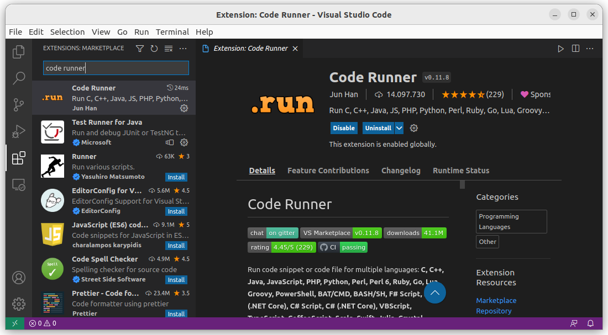
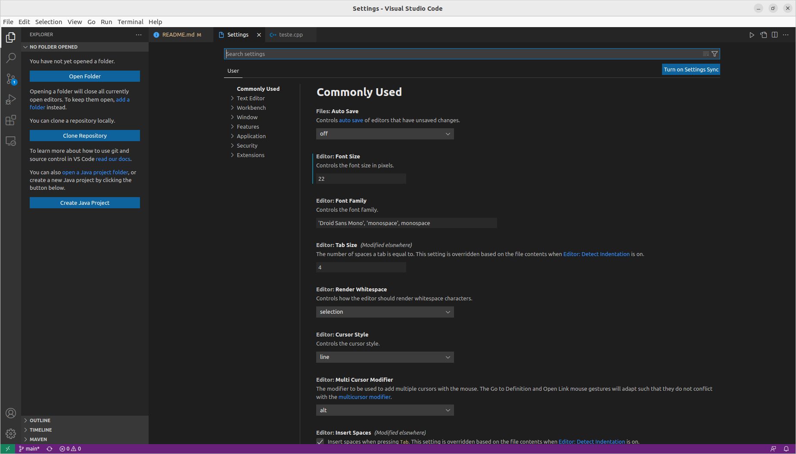
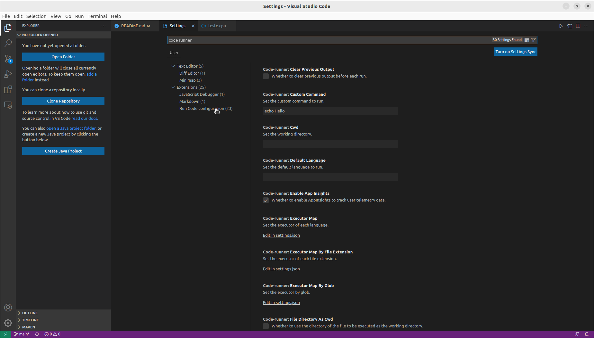
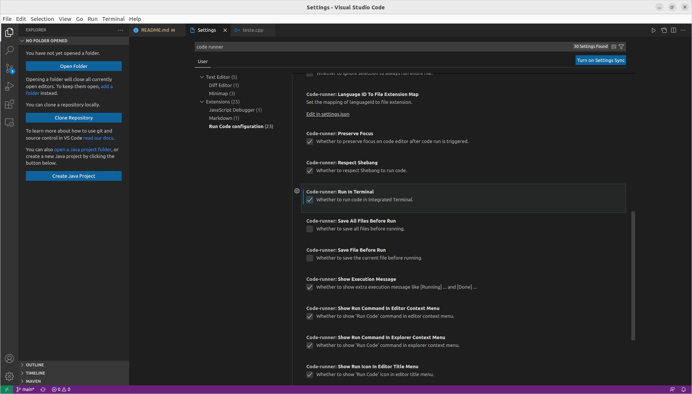
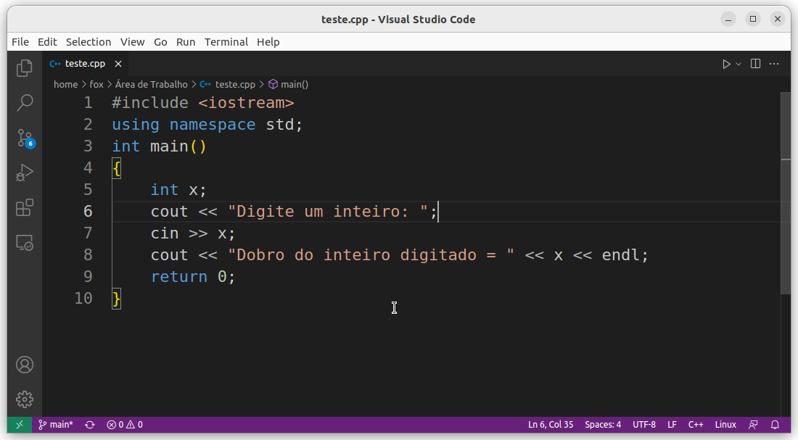
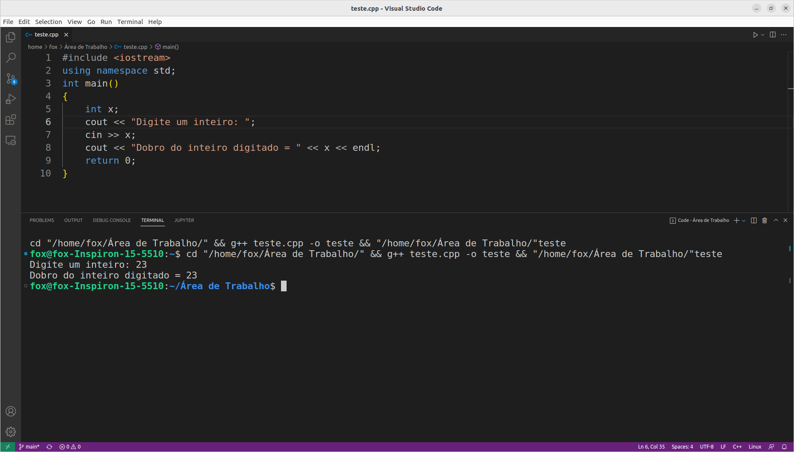

# Instalando a extensão Code Runner no VS Code

Após instalar o compilador g++ do C++ e após instalar o VS Code, agora você pode instalar o plugin Code Runner.

O Code Runner permite que você execute um trecho de código ou um arquivo de código em várias linguagens de programação, incluindo códigos em linguagem C++.

Para instalá-lo, você pode pesquisar no marketplace do VS Code.



Após a instalação, reinicie o VS Code.

Com o VS Code reiniciado, é preciso agora configurar o plugin Code Runner para que ele funcione corretamente. 

Vá para a barra de menu do VS Code e Clique em **Arquivo -> Preferências -> Configurações**

Será aberta uma aba semelhante à aba abaixo:



Pesquise por **code runner** e depois clique em **code runner configuration**



Busque a opção **Run in Terminal** e marque ela:



Selecione também a opção **Save All Files Before Run**:


Por fim, tecle CTRL+S para salvar as configurações.

Pronto! O seu Code Runner está instalado e configurado.

---

## Criando um programa C++ simples

Crie um arquivo com nome **test.cpp** e abra-o no VS Code. 
Digite o seguinte código C++ no arquivo e salve-o: 

```c++
#include <iostream>
using namespace std;
int main() 
{
    int x;
    cout << "Digite um inteiro: ";
    cin >> x;
    cout << "Dobro do inteiro digitado = " << x << endl;
    return 0;
}
```



---

## Executando seu código usando o Code Runner

- Use o atalho Ctrl+Alt+N.
- Ou pressione F1 e selecione/digite Run Code (Executar o código).
- Ou clique com o botão direito no editor de texto e clique em Run Code no menu de contexto do editor.

O código será executado e a saída será mostrada na janela de saída. Abra a janela de saída com o atalho Ctrl+.




## Para parar o código em execução

- Use o atalho Ctrl+Alt+M.
- Ou pressione F1 e selecione/digite **Stop Code Run** (Parar a execução do código).
- Ou clique com o botão direito na janela de saída e clique em **Stop Code Run** no menu de contexto.

Viva! Você acabou de configurar com sucesso seu ambiente C++ no VS Code!


