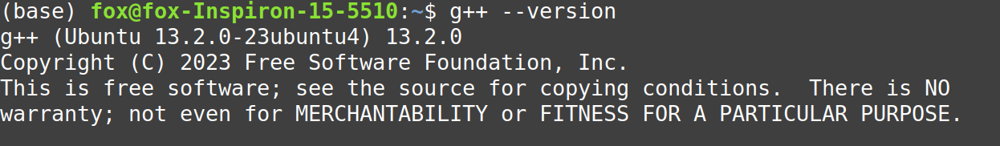
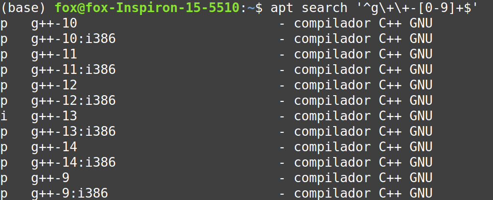
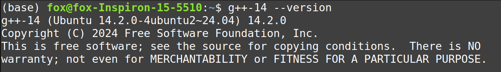
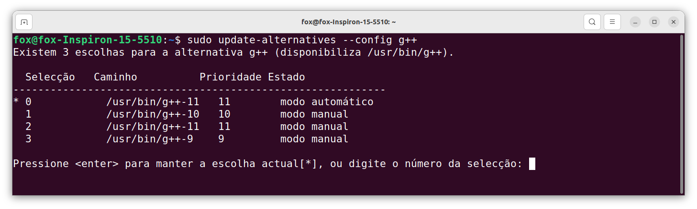
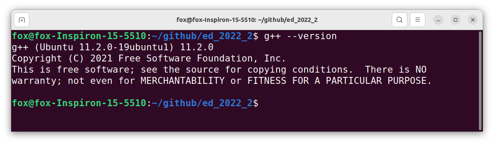

# Instalando e usando o g++ no Ubuntu

O compilador g++ GNU é um compilador de sistema Linux usado especificamente para compilar programas C++. As extensões de arquivo desses programas são .cpp que são compiladas usando o compilador g++.

A instalação padrão do g++ no seu Linux pode não vir com as versões mais recentes das bibliotecas do C++, portanto, se você quiser aproveitar os recursos oferecidos pelos novos padrões C++ (C++17 ou C++20 por exemplo), você precisa instalar e alternar manualmente as bibliotecas.

Este tutorial tem como objetivo fornecer um guia detalhado sobre como instalar e usar o compilador g++ no sistema Ubuntu 20.04 LTS em diante e seus derivados como Linux Mint, etc. Você pode atingir esse objetivo instalando algumas ferramentas de desenvolvimento chamadas pacotes essenciais de compilação em seu sistema.

## Passo 1. Instalando o *build-essential*

O repositório padrão oficial do Ubuntu contém várias ferramentas ou pacotes de desenvolvimento. Você pode instalar essas ferramentas diretamente instalando um meta-pacote do Ubuntu chamado "build-essential" em seu sistema que inclui as importantes bibliotecas de desenvolvimento, depurador GNU e coleções de compiladores necessários para compilar aplicativos C/C++. Portanto, é necessário instalar build-essential em seu sistema antes de instalar qualquer compilador. Digite os seguintes comandos no terminal do linux para instalar as ferramentas de desenvolvimento:

```
sudo apt update

sudo apt install build-essential
```

Este comando instala a versão padrão mais recente do g++ disponível nos repositórios da sua distribuição Ubuntu atual e é suficiente para a maioria dos usuários. O último comando acima instala alguns pacotes úteis incluindo g++, gcc e make.

---

## Passo 2. Verificando a versão do g++

Depois que todos os pacotes de desenvolvimento estiverem instalados, digite o seguinte comando para verificar a versão instalada do compilador g++:

```
g++ --version
```

Se o g++ estiver instalado, uma mensagem parecida com esta deve aparecer no terminal:



Pronto! Com isso, você já tem o g++ instalado na sua máquina e já pode programar. Se você quiser seguir em frente e instalar outras versões do mesmo compilador, siga os passos abaixo.

---

## Passo 3. Instalando múltiplas versões do g++ no seu sistema


Se uma versão específica do g++ for necessária, talvez para fins de compatibilidade ou testes, você poderá instalá-la junto com a versão padrão. Após ter instalado o build-essential nas etapas anteriores, você pode instalar múltiplas versões do compilador g++ no seu sistema, se você quiser. 

Primeiro, verifique quais versões do g++ estão disponíveis para instalaçãoo seu sistema, digitando o comando abaixo no terminal do linux:

```
apt search '^g\+\+-[0-9]+$'
```

Uma saída parecida com a imagem abaixo deve ser mostrada:



Este comando lista todas as versões g++ disponíveis. Escolha a versão que se adapta às suas necessidades.

Depois de decidir qual versão você precisa, você pode instalá-la. Eu escolhi intalar a versão 14 do g++:


```
sudo apt install g++-14
```

O comando acima será concluído em alguns minutos após a instalação da versão escolhida do compilador g++ em seu sistema linux.

Agora você pode verificar se a instalação foi concluída com sucesso verificando a versão do g++:

```
g++-14 --version
```



---

### Passo 5. Criando uma lista de alternativas do g++ usando ferramentas de atualização de alternativas

A ferramenta **update-alternatives** é usada para criar uma lista de várias alternativas de compilador g++. Usando os comandos abaixo mencionados, o usuário pode criar a lista de várias alternativas g++ no sistema Ubuntu:

```
sudo update-alternatives --install /usr/bin/g++ g++ /usr/bin/g++-11 11

sudo update-alternatives --install /usr/bin/g++ g++ /usr/bin/g++-13 13

sudo update-alternatives --install /usr/bin/g++ g++ /usr/bin/g++-14 14
```


Agora, exiba a lista de alternativas do g++ em seu sistema Ubuntu usando o seguinte comando *update-alternatives*:

```
sudo update-alternatives --config g++
```

Verifique a versão g++ disponível na lista exibida no terminal da seguinte forma:



Escolha a versão do compilador g++ que você deseja usar como o compilador padrão para desenvolvimento de software. Pressione 'enter' para manter a escolha atual definida como padrão ou selecione o número da lista de alternativas do g++.

Agora, você pode verificar a versão do g++ que está sendo usada com o seguinte comando:

```
g++ --version
```



Pronto! Com isso, a versão mais recente do compilador g++ está instalada no seu Ubuntu!
